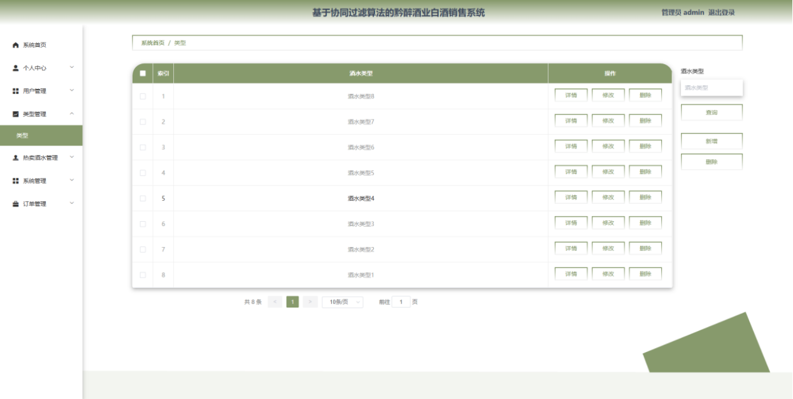

# springboot213-协同过滤算法的白酒销售系统

>  博主介绍：
>  Hey，我是程序员Chaers，一个专注于计算机领域的程序员
>  十年大厂程序员全栈开发‍ 日常分享项目经验 解决技术难题与技术推荐 承接各类网站设计，小程序开发，毕设等。
>  【计算机专业课程设计，毕业设计项目，Java，微信小程序，安卓APP都可以做，不仅仅是计算机专业，其它专业都可以】

## 3000套系统可挑选，获取链接：https://chaerspol.github.io/

<b>QQ【获取完整源码】：674456564</b>

<b>QQ群【获取完整源码】：1058861570</b>

### 系统架构

> 前端：html | js | css | jquery | vue
>
> 后端：springboot | mybatis
> 
> 环境：jdk1.8+ | mysql | maven

# 一、内容包括
包括有  项目源码+项目论文+数据库源码+答辩ppt+远程调试成功

# 二、运行环境

> jdk版本：1.8 及以上； ide工具：IDEA； 数据库: mysql5.7及以上；编程语言: Java

# 三、需求分析

**3.1 系统可行性分析**

**3.1.1技术可行性**

本企业网站在Windows操作系统中进行开发，并且目前PC机的性能已经可以胜任普通网站的web服务器。系统开发所使用的技术也都是自身所具有的，也是当下广泛应用的技术之一。
本系统在Windows操作系统中独立进行开发，现在的PC电脑性能中上的一类完全可以胜任WEB服务器一职，此系统的开发技术是我自身也具有一定底子的，且这些技术也都挺时髦，用途普遍、广泛。
系统的开发环境及配置相对简单，IDEA平台也给了开发者提供诸多便利开发起来十分顺畅，用JAVA语言开发可移植性稳定性都比较强，加上成熟的Mysql数据库进行前后台的数据交互，根据业务需求逐步完善系统，使得网站运行稳定安全。

**3.1.2经济可行性**

本系统开发之前的所有调研基本都是本人独立完成，需求设计，功能开发等也都是自己及指导老师的帮助下完成，通过自己的努力解决掉开发过程中所遇到的问题经济支出可以忽略不计，固黔醉酒业白酒销售系统在经济可行性上完全可行可以开发。

**3.1.3操作可行性**

可操作性主要是对黔醉酒业白酒销售设计完成后，基于协同推荐的黔醉酒业白酒销售系统在设计完成时页面简单，不论是用户还是管理员登录系统后稍加适应，便可熟练掌握并使用。不需要专业的计算机人员进行指导，会些简单的鼠标点击及键盘输入就能使用。

**3.2 需求分析**

本系统需求主要从三方面进行介绍，一方面是黔醉酒业基于当前电商大环境下应该如何发开自己的系统才能具有核心竞争力，一方面是设计此系统管理员应该具有哪些需求，最后一方面则是用户的需求。
进行系统开发前应该先进行初步调查，自顶向下的系统化观点全面调查是必要的。首先对中国酒水企业和中国酒水消费情况进行详细调查，从而发现中小型酒水企业内部运作机制还存在哪些问题需要解决，他们还有需要什么样的功能来帮助企业获得最大利润网。经过对中小型白酒销售企业的多次调查和分析后，发现目前我国的大多数中小型酒类销售上的销售管理工作还停留在电子报表模式中。具体归纳有以下几点:

(1)销售业务管理工作上缺乏规范性，不按正规流程处理，大量的工作皆是手工处理，效率不高，容易出错。查询种种信息的时候只能通过Excel技术翻阅来得到信息，当销售信息，客户信息十分多的时候，速度就会非常慢。

(2)黔醉酒业销售企业内部管理工作效率低下，工作量十分巨大: 客户、供货商、和公司联系不够紧密:且销售模式还是以各级经销商通过社交软件以及线下门店进行交易。这种模式作为客户来讲线下门店受地域及时间的限制可能不方便前往，而基于微信登社交媒体的交易呢又显得不太安全
此系统管理员管理应该可以进行包括个人中心管理、首页管理、用户管理、类型管理、产品管理、订单管理、在线客服在内的几大功能模块。
用户则应该可以实现首页、热卖酒水、购物车、优惠资讯，在我的页面可以对个人中心、我的订单、我的收藏管理、我的地址等功能进行详细操作。
白酒销售的业务流程中一共有五个业务处理单位，分别是客户、财务、销售、库存、供应商，这是系统外部单位。这几个部门联系紧密牵一发能动全身，表的联动就显得十分关键。不应该存在已退款但是库存还是没有增长的情况。

# 四、功能模块

为了更好的去理清本系统整体思路，对该系统以结构图的形式表达出来，设计实现该基于协同推荐的黔醉酒业白酒销售系统的功能结构图如下所示。

# 五、效果图展示【部分效果图】

图5-1后台登录界面图【后台登录，用户通过输入用户名、密码，选择角色并点击登录进行系统登录操作，如图5-1所示】

图5-2管理员功能界面图【管理员登陆系统后，可以对首页、个人中心、用户管理、类型管理、热卖酒水管理、系统管理、优惠资讯管理、系统简介管理、订单管理等功能进行相应操作，如图5-2所示】

图5-3用户管理界面图【用户管理，在用户管理页面可以对索引、用户账号、用户姓名、性别、年龄、头像等内容进行详情、修改或删除等操作，如图5-3所示。】

图5-4类型管理界面图【类型管理，在类型管理页面可以对索引、酒水类型等内容进行详情，修改或删除等操作，如图5-4所示。】

图5-5热卖酒水管理界面图【热卖酒水管理，在热卖酒水页面可以对索引、酒水名称、封面、酒水类型、包装形式、品牌、度数、储藏方法、生产年份等内容进行详情，修改，查看评论或删除等操作，如图5-5所示。】

图5-6优惠资讯管理界面图【优惠资讯管理，在优惠资讯管理页面可以对索引、标题、图片、等内容进行详情、修改和删除等操作，如图5-6所示。】

图5-7系统简介管理界面图【系统简介管理，在系统简介管理页面可以对索引、标题、副标题	、图片等内容进行详情，修改或删除等操作，如图5-7所示。】

 <b>完整文章</b>
 
 

## 3000套系统可挑选，获取链接：https://chaerspol.github.io/

<b>QQ【获取完整源码】：674456564</b>

<b>QQ群【获取完整源码】：1058861570</b>

